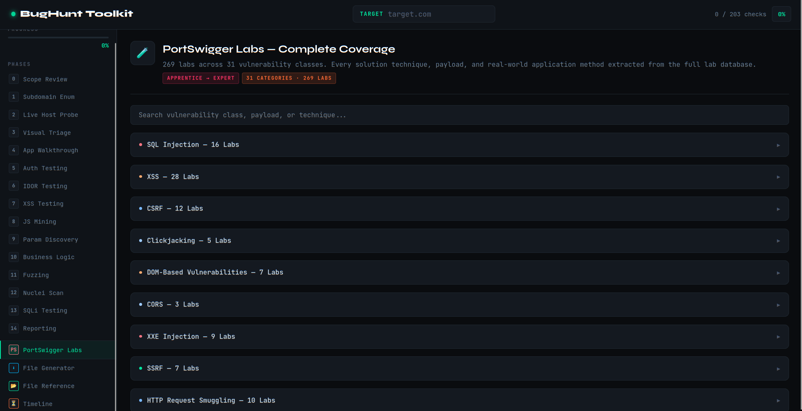
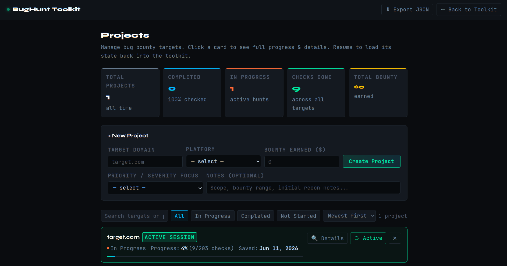

<h1 align="center">
  <a href="https://other4.github.io/raje-bug-toolkit/">
    
  </a>
  <br>
  <p>BugHunt Toolkit — Browser-Based Bug Bounty Workflow</p>
</h1>

<p align="center">
  <a href="#"></a>
  <a href="#"></a>
  <a href="#"></a>
  <a href="#"></a>
  <a href="#"></a>
  <a href="#"></a>
  <a href="#"></a>
  <a href="#"></a>
</p>

<p align="center">
  <a href="#-features">Features</a> •
  <a href="#-project-management">Projects</a> •
  <a href="#️-phases-covered">Phases</a> •
  <a href="#-generated-scripts">Scripts</a> •
  <a href="#-portswigger-labs-coverage">PortSwigger Labs</a> •
  <a href="#-usage">Usage</a> •
  <a href="#️-tools-referenced">Tools</a> •
  <a href="#-expected-output-file-structure">Output Files</a> •
  <a href="#️-legal--ethical-use">Legal</a> •
  <a href="#-contributing">Contributing</a> •
  <a href="#-license">License</a>
</p>

---

## 📸 Preview

> A dark-themed, two-file HTML toolkit that runs entirely in your browser — no install, no backend, no dependencies.


---



---



---

## ✨ Features

- **19 hunting phases** — from passive recon to vulnerability reporting, covering every stage of a real engagement
- **Persistent state via localStorage** — checklist progress, active phase, accordion state, and target domain all survive page refreshes
- **Multi-project management** — `projects.html` tracks multiple bug bounty targets with status, progress, bounty earned, and notes
- **Target-aware copy** — set your target domain once; every command and script auto-fills it throughout
- **One-click script generator** — downloads 11 pre-filled bash scripts ready to run (`chmod +x`)
- **269 PortSwigger lab solutions** — every technique across 31 vulnerability classes, searchable by keyword or payload
- **Program finder** — curated links to Global, EU, India, and Government bug bounty platforms with direct URLs
- **File output reference** — maps every generated recon file to its purpose and check priority
- **Timeline & anti-patterns** — realistic first-bug timeline and the exact mistakes that produce zero findings
- **interactsh integration** — free Burp Collaborator alternative built into every OOB payload section
- **Safe SQLMap reference** — safe vs destructive flags side-by-side with explicit warnings
- **Zero dependencies** — pure HTML/CSS/JS, no frameworks, no CDN calls for logic

---

## 📁 Project Management

The toolkit ships with two files that work together:

| File | Purpose |
|------|---------|
| `bbh-toolkit.html` | Main hunting workflow — phases, checklists, code blocks, script generator |
| `projects.html` | Project manager — create, resume, delete, and track multiple targets |

### How it works

- **New Project** button (top-right of toolkit) opens a modal to create a project and switch to it immediately
- All checklist progress, active phase, and accordion state are auto-saved to `localStorage` under the key `bbh_toolkit_state`
- Every save is synced into `bbh_projects` so `projects.html` always reflects live progress
- **Resume** on any project card loads that target's full saved state back into the toolkit
- **Delete** permanently removes the project from `bbh_projects`, clears `bbh_toolkit_state` if it was the active session, and writes a tombstone to `bbh_deleted_targets` so the toolkit never re-creates it automatically
- Projects track: target domain, platform, severity focus, bounty earned, notes, checklist progress, and last saved date
- **Export JSON** in `projects.html` downloads all projects as a timestamped backup file

### Project stats tracked

- Total projects
- Completed (100% checks)
- In Progress
- Total checks done across all targets
- Total bounty earned

---

## 🗂️ Phases Covered

| # | Phase | Type |
|---|-------|------|
| 0 | Scope Review | Manual · Critical |
| 1 | Passive Subdomain Enumeration | Automated |
| 2 | Live Host Probing & Tech Fingerprinting | Automated |
| 3 | Visual Triage (Screenshots) | Automated + Manual |
| 4 | Manual Application Walkthrough | Manual · Critical |
| 5 | Authentication Flow Testing | Manual |
| 6 | IDOR Testing | Manual |
| 7 | XSS Testing | Manual → Automated |
| 8 | JS Mining & Secret Discovery | Automated + Manual |
| 9 | Parameter Discovery | Automated |
| 10 | Business Logic & Advanced Testing | Manual |
| 11 | Directory & Endpoint Fuzzing | Automated |
| 12 | Nuclei Scanning | Automated |
| 13 | SQLi Testing | Manual → Automated |
| 14 | Reporting | Manual |
| PS | PortSwigger Labs Reference | Reference · 269 labs |
| ⬇ | File Generator | One-click script download |
| 📂 | File Output Reference | Reference |
| ⏳ | Timeline & Anti-Patterns | Mindset · Critical |

---

## 📦 Generated Scripts

The **File Generator** tab produces 11 ready-to-run bash scripts, pre-filled with your target domain:

```
00_setup_workspace.sh     Create all output directories and placeholder files
01_subdomain_enum.sh      Phase 1 — Passive enumeration (subfinder, amass, crt.sh, OTX, urlscan, Wayback)
02_live_probe.sh          Phase 2 — Live host probing and tech fingerprinting
03_screenshots.sh         Phase 3 — Visual triage screenshots (gowitness / eyewitness)
04_js_mining.sh           Phase 8 — JS crawl, secret scanning, high-value file discovery
05_param_discovery.sh     Phase 9 — Parameter mining and vulnerability class filtering
06_fuzzing.sh             Phase 11 — Directory fuzzing, extension scanning, API discovery
07_nuclei.sh              Phase 12 — Nuclei scanning (rate-limited), subzy, corsy
08_cors_test.sh           Phase 10 — CORS origin reflection testing
09_403_bypass.sh          Phase 10 — Path and header-based 403 bypass techniques
10_interactsh_setup.sh    OOB testing — interactsh install and startup (free Burp Collaborator alternative)
```

All scripts use `TARGET="your-domain.com"` as the first variable. Download → `chmod +x` → run.

---

## 🧪 PortSwigger Labs Coverage

Full solution techniques for all 31 vulnerability classes across 269 labs — searchable by keyword, payload, or technique directly in the browser:

| Category | Labs | Key Techniques |
|----------|------|----------------|
| SQL Injection | 16 | UNION, Blind conditional, Time-based, OOB exfil, Visible error, Login bypass |
| XSS | 28 | Stored, Reflected, DOM, CSP bypass, AngularJS, postMessage, cookie theft |
| CSRF | 12 | Token bypass, SameSite Lax/Strict, Referer validation, method override |
| SSRF | 7 | Localhost, cloud metadata (AWS/GCP/Azure), whitelist bypass, Shellshock |
| XXE | 9 | File retrieval, OOB DTD exfil, Error-based, XInclude, SVG upload, Local DTD |
| HTTP Smuggling | 10 | CL.TE, TE.CL, H2.TE, obfuscation, capture requests, bypass security controls |
| JWT | 8 | alg:none, jwk injection, jku header, kid path traversal, alg confusion RS→HS |
| SSTI | 7 | Jinja2, Freemarker, Handlebars, Twig, ERB, sandbox escape |
| OAuth | 6 | Implicit flow, redirect_uri manipulation, SSRF via registration, CSRF linking |
| Race Conditions | 6 | Limit overrun, single-packet attack, multi-endpoint, time-sensitive tokens |
| Prototype Pollution | 10 | Browser API, DOM XSS gadgets, server-side, Node.js RCE via execArgv |
| Access Control / IDOR | 13 | robots.txt, header bypass, method switch, UUID IDOR, multistep skip |
| Authentication | 14 | Username enum, 2FA bypass, reset poisoning, JSON array brute force |
| Business Logic | 12 | Price manipulation, negative qty, integer overflow, workflow bypass |
| Path Traversal | 6 | Simple, absolute, encoded sequences, null byte, prefix validation |
| File Upload | 7 | MIME bypass, .htaccess, extension obfuscation, polyglot, race condition |
| CORS | 3 | Origin reflection, null origin, insecure protocol chain |
| Clickjacking | 5 | Basic, frame buster bypass, multistep, DOM XSS combo |
| Deserialization | 10 | PHP bool/type, Java ysoserial, phpggc, custom gadget chain, PHAR |
| GraphQL | 6 | Introspection, alias brute force, CSRF via GET, hidden mutations |
| Web Cache Poisoning | 10+ | Unkeyed headers, param cloaking, fat GET, URL normalization |
| Web Cache Deception | 5 | Path mapping, delimiter discrepancy, normalization gaps |
| NoSQL Injection | 4 | MongoDB operator injection, auth bypass, data extraction via regex |
| OS Command Injection | 5 | In-band, time delay, output redirection, OOB DNS exfil |
| Host Header Attacks | 6 | Reset poisoning, auth bypass, routing SSRF, dangling markup |
| WebSockets | 3 | Message XSS, cross-site hijacking (CSWSH), handshake manipulation |
| API Testing | 5 | Mass assignment, param pollution, unused endpoints, Swagger discovery |
| Information Disclosure | 5 | Error messages, debug pages, .git history, backup files |
| DOM-Based | 7 | postMessage, JS URL, JSON.parse, open redirect, cookie manipulation |
| Web LLM Attacks | 4 | Excessive agency, indirect prompt injection, insecure output handling |
| Essential Skills | 2 | Targeted scanning, non-standard data structures |

---

## 🚀 Usage

### Option 1 — Open directly

```bash
git clone https://github.com/other4/bughunt-toolkit.git
cd bughunt-toolkit
open bbh-toolkit.html          # macOS
xdg-open bbh-toolkit.html      # Linux
```

No server needed. Open `bbh-toolkit.html` in any modern browser. Keep `projects.html` in the same directory.

### Option 2 — GitHub Pages

Enable GitHub Pages on the `main` branch:

```
https://other4.github.io/bughunt-toolkit/
```

### Workflow

1. Open `bbh-toolkit.html` — a **New Project** prompt appears on first visit
2. Enter your target domain and create a project
3. Work through phases **in order** — start with Phase 0 (scope review, non-negotiable)
4. Check off checklist items as you complete them — progress saves automatically
5. Use **⎘ Copy** on any code block — commands auto-fill with your target domain
6. Go to **File Generator** to download all 11 bash scripts pre-filled with your target
7. Use **PortSwigger Labs** as a reference during manual testing
8. Switch to `projects.html` via **⊞ Projects** to manage multiple targets or resume a previous session

### localStorage keys used

| Key | Contents |
|-----|---------|
| `bbh_toolkit_state` | Active session: target, checked items, active phase, open sections |
| `bbh_projects` | All saved projects array (max 50) |
| `bbh_deleted_targets` | Tombstone list — prevents deleted projects from being re-created |

---

## 🛠️ Tools Referenced

The scripts and phases reference these tools. Install as needed:

```bash
# Recon & discovery
go install -v github.com/projectdiscovery/subfinder/v2/cmd/subfinder@latest
go install -v github.com/projectdiscovery/httpx/cmd/httpx@latest
go install -v github.com/projectdiscovery/katana/cmd/katana@latest
go install -v github.com/projectdiscovery/naabu/v2/cmd/naabu@latest
go install -v github.com/projectdiscovery/nuclei/v3/cmd/nuclei@latest
go install -v github.com/projectdiscovery/interactsh/cmd/interactsh-client@latest
go install -v github.com/lc/gau/v2/cmd/gau@latest
go install -v github.com/tomnomnom/waybackurls@latest
go install -v github.com/tomnomnom/gf@latest
go install -v github.com/hahwul/dalfox/v2@latest

# Fuzzing
# ffuf:  https://github.com/ffuf/ffuf
# arjun: pip install arjun

# Screenshots
# gowitness:  https://github.com/sensepost/gowitness
# eyewitness: https://github.com/RedSiege/EyeWitness

# Miscellaneous
# wafw00f:      pip install wafw00f
# corsy:        https://github.com/s0md3v/Corsy
# subzy:        https://github.com/PentestPad/subzy
# SecretFinder: https://github.com/m4ll0k/SecretFinder
# amass:        https://github.com/owasp-amass/amass
# sqlmap:       https://github.com/sqlmapproject/sqlmap
```

---

## 📁 Expected Output File Structure

After running recon phases, your working directory will contain:

```
target-recon/
├── all_subs.txt              All discovered subdomains (deduplicated)
├── live_subs.txt             Live HTTP/S hosts
├── httpx_output.txt          Tech / status / title / IP fingerprints
├── behind_waf.txt            Hosts behind a known WAF
├── no_waf_subs.txt           Hosts without WAF (higher priority targets)
├── alive_ports.txt           Hosts alive on non-standard ports
├── naabu_ports.txt           Open ports from naabu
├── nmap_scan.txt             Service / version fingerprints
├── waf_results.txt           wafw00f WAF detection output
├── tech_php.txt              PHP hosts
├── tech_asp.txt              ASP/.NET hosts
├── tech_java.txt             Java hosts
├── screenshots/              gowitness / eyewitness visual triage images
├── endpoints.txt             All crawled URLs (katana + waybackurls + gau)
├── all_js_files.txt          JS file URLs
├── all_params.txt            All parameterized URLs (combined + deduplicated)
├── wayback_params.txt        Parameterized URLs from Wayback Machine
├── gau_params.txt            Parameterized URLs from gau
├── arjun_params.txt          Hidden parameters from Arjun
├── secrets_found.txt         Potential API keys / tokens from JS (SecretFinder)
├── js_manual_review.txt      JS files containing sensitive keywords
├── high_value_files.txt      .env / .bak / .config / .sql — CHECK EVERY ONE
├── dom_sinks.txt             Dangerous JS sinks found via grep
├── candidates_xss.txt        XSS candidate URLs (gf-filtered)
├── candidates_idor.txt       IDOR candidate URLs
├── candidates_ssrf.txt       SSRF candidate URLs
├── candidates_redirect.txt   Open redirect candidates
├── candidates_lfi.txt        LFI candidate URLs
├── candidates_sqli.txt       SQLi candidate URLs
├── ffuf_dirs.json            Directory fuzzing results
├── ffuf_ext.json             Extension fuzzing results (.bak / .env / .zip)
├── ffuf_api.json             API endpoint fuzzing results
├── nuclei_misconfig.txt      Nuclei misconfiguration findings
├── nuclei_cves.txt           Nuclei CVE match findings
├── nuclei_js.txt             Nuclei exposure findings from JS files
├── cors_results.txt          CORS misconfiguration findings (corsy)
└── subzy_results.txt         Subdomain takeover candidates
```

**Priority order after recon:** `high_value_files.txt` → `secrets_found.txt` → `subzy_results.txt` → `nuclei_cves.txt` → `candidates_idor.txt` → `candidates_xss.txt`

---

## ⚠️ Legal & Ethical Use

This toolkit is intended **exclusively for authorized security testing**:

- Only test targets you have **explicit written permission** to test
- Always read and follow the **program policy** before running any tool (Phase 0 — non-negotiable)
- Never test out-of-scope assets
- Never run destructive commands (`--os-shell`, `--dump`, DoS tools, `--level=5 --risk=3`)
- Follow responsible disclosure — report findings through the proper program channel

Unauthorized access to computer systems is illegal. The authors accept no liability for misuse.

---

## 🤝 Contributing

Contributions are welcome. To add a technique, fix a command, or add a new phase:

1. Fork the repository
2. Create a branch: `git checkout -b feature/your-feature`
3. Make changes to `bbh-toolkit.html` and/or `projects.html`
4. Test in browser — check localStorage persistence across refreshes
5. Open a pull request with a clear description of what changed and why

---

## 📄 License

MIT License — see [LICENSE](LICENSE) for details.

---

<div align="center">

Built for the bug bounty community · No tracking · No backend · No BS

</div>
